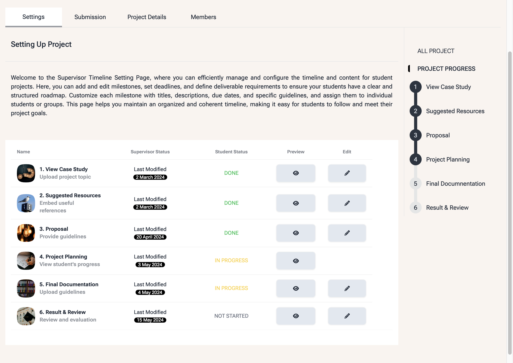
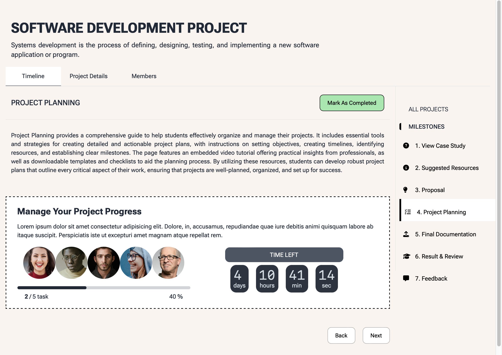
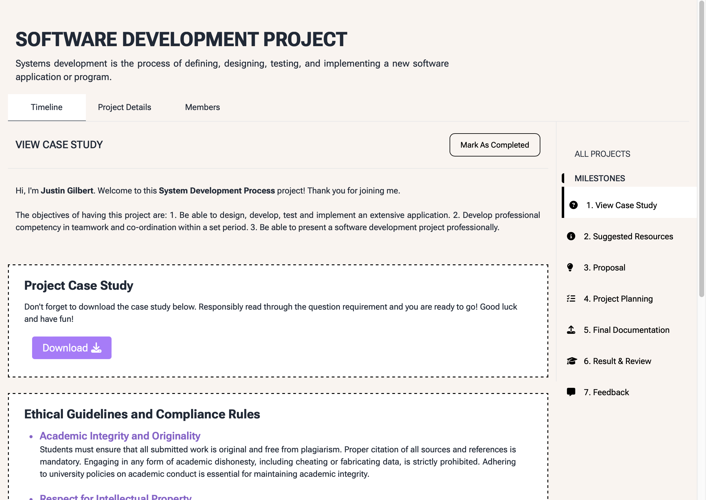

<p align="center">
  
  
</p>

<p align="center">
  A role-based Final Year Project (FYP) management platform for Students, Supervisors, and Admins.
</p>

<p align="center">
  
  
  
  
  
</p>

## Overview

AcademiX is a full-stack platform that manages the entire lifecycle of a Final Year / capstone
project — from case study and proposal, through project planning and milestones, to final
documentation, grading, and result & review. Students, Supervisors, and Admins each get a
dedicated dashboard and workflow, backed by task/kanban boards, a calendar, a file manager, and
real-time chat and notifications.

## Screenshots

| Supervisor: setting up a project timeline | Student: project planning milestone |
| :---: | :---: |
|  |  |

<p align="center">
  
  <br/>
  <sub>Student: case study milestone</sub>
</p>

## Features

- **Role-based dashboards** — separate Admin, Student, and Supervisor experiences
- **Project timeline & milestones** — case study, proposal, project planning, final documentation, result & review
- **Proposals, grading & feedback** — supervisors review, grade, and leave feedback on student work
- **Tasks & Kanban boards** — per-project task tracking with drag-and-drop boards
- **Calendar** — deadlines and milestone scheduling
- **File manager** — upload and organize project documents/deliverables
- **Real-time inbox** — chat between students and supervisors
- **Real-time notifications** — pushed over Socket.io

## Tech stack

| Service | Stack |
| --- | --- |
| `academix` (main frontend) | Next.js 14, React 18, TypeScript, Chakra UI, Tailwind CSS, Redux Toolkit |
| `fyp-management-system-backend` (core API) | Node.js, Express, TypeScript, MongoDB/Mongoose, Redis, Socket.io, JWT auth |

## Project structure

```
AcademiX-Project-Portal/
├── academix/                        # Main app (Next.js, port 3000)
│   ├── pages/                       #   Admin / Student / Supervisor dashboards, projects, auth, inbox, crm...
│   ├── components/                  #   Shared UI components (Layout, Sidebar, Header, Logo, Modal, ...)
│   ├── redux/features/              #   Redux Toolkit slices & RTK Query API (auth, user, notifications)
│   ├── templates/                   #   Page-level templates (Dashboard, CRM, Profile, Project Management...)
│   ├── hooks/ constants/ mocks/     #   Shared hooks, nav config, mock data for UI states
│   ├── public/                      #   Static assets (logo, images, file manager icons)
│   └── app/                         #   Marketing site (App Router) — merged in from the former landingPage app
│
├── fyp-management-system-backend/   # Core REST API (Express, port 8000)
│   ├── controllers/                 #   Request handlers (project, proposal, grade, feedback, course, order...)
│   ├── models/                      #   Mongoose schemas
│   ├── routes/                      #   Express routers, mounted under /api/v1
│   ├── services/                    #   Business logic used by controllers
│   ├── middleware/                  #   Auth, error handling, rate limiting
│   └── socketServer.ts              #   Real-time notifications/chat via Socket.io
```

## Getting started

Each service runs independently — start the ones you need in separate terminals:

1. **Main app** — `cd academix && npm run dev` → http://localhost:3000 (serves the marketing site at `/`, the dashboards, and the inbox chat auth API)
2. **Core backend API** — `cd fyp-management-system-backend && npm run dev` → http://localhost:8000

> Each service manages its own dependencies — run `npm install` inside each folder before its
> first `npm run dev`. Backend services also expect their own `.env` file (Mongo/Redis URIs,
> JWT secrets, Stripe keys, etc.) which is not committed to this repo.
